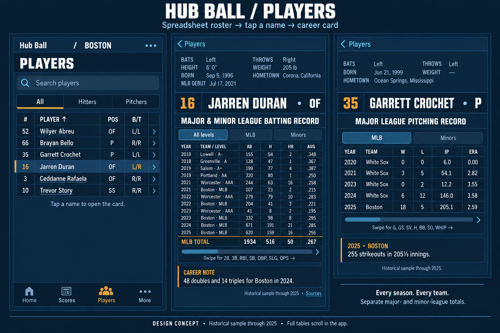

# Coding-agent handoff: Players spreadsheet and career card

User-approved design, September 16, 2026. This handoff and its reference image are the only deliverables so far; application implementation has not begun.

## Task and approved reference

Implement the Players section of the canonical native Hub Ball app as a spreadsheet directory. Tapping a player's name opens a baseball-card-back detail with biographical information above a complete year-by-year career table. Apply this to every player across the existing 30-team directories.

The user approved the structure, then explicitly requested removal of the upper-right comic illustrations and use of the existing app color scheme. The revised navy mockup below is the approved design. It supersedes the original green/red paper mockup.

Reference image: `docs/design/players-baseball-card-approved.png`. Keep this image with the Markdown when handing it to another agent. It is a generated visual specification, not a screenshot of working software and not a statistical source. Build real native controls and tables; do not display the mockup image as the interface.

## Repository and constraints

- Work in `/Users/sfrancoe/Projects/Hub Ball`. Read its `AGENTS.md` before implementation. The canonical release branch is `main`; `/Users/sfrancoe/Projects/MLB Apps` is archived and must not be used for this work.
- Use the existing SwiftUI/Foundation app and Python standard-library data pipeline. Add no dependencies or new framework/build toolchain.
- Preserve existing player navigation and team selection. Use a shared implementation across teams.
- Generate data through scripts; do not manually edit generated feeds. Preserve unrelated work, including any existing leaders plan.
- No paid service without the user's approval. The handoff does not request a release, TestFlight upload, or device installation. Follow repository release rules when those are separately requested.

## Intended experience

Apply one shared design to every player in the existing 30-team Players directories. The selected team's roster opens as a compact spreadsheet: number, player name, position, bats/throws, age, and roster status. Search and position filters remain. Tapping a column heading sorts; tapping a name navigates to that player's card. Preserve incoming player links and restore the list's search, sort and scroll position on return.

The player detail retains the information hierarchy of a baseball-card back, using Hub Ball's current Night Game palette: dark navy surfaces, off-white text, thin blue rules, condensed headings, amber emphasis and tightly aligned statistical columns. Use flat native surfaces without paper texture, faded printing or thick retro borders. Do not add comics, player drawings, photographs or decorative illustration frames.

Top panel: height, weight, bats, throws, date and place of birth, and MLB debut, in compact aligned label/value groups. Use the full available width now that the illustration is removed. Immediately below, show a distinct name band with jersey number, full name and position. Keep missing fields visibly unavailable rather than inferring facts. Education and source links belong below the career record. Any short career note must be generated from verified facts, not invented trivia. Label birthplace as birthplace; the mockup's word “Hometown” must not cause birthplace to be presented as a different biographical fact.

Below the biography, show the entire available professional career chronologically, one row per season/team/level. Default to all levels, with MLB, Minors and other relevant league filters. Identify minor-league clubs and historical levels explicitly. International professional seasons require league-specific sources; never label MLB-only data as the entire professional career. Regular season is the default; postseason, if exposed, is a separate mode and never added to regular-season totals.

On iPhone, keep Year and Team visible while the statistical columns scroll horizontally. Scroll vertically through long careers with a pinned table header. On iPad and landscape, use the wider space to expose more columns. Do not shrink a 20-year career to illegible text. Support Dynamic Type, VoiceOver row descriptions and generous name tap targets.

## Exact visual specification

Reuse `ios/Hub Ball/Hub Ball/AppTheme.swift` rather than introducing a parallel color system. These are the existing tokens read from the canonical app:

| Purpose | Existing token | Hex |
| --- | --- | --- |
| Main background | `AppColor.night` | `#0B1B2B` |
| Raised biography/header panels | `AppColor.nightRaised` | `#14293D` |
| Selected rows/cells | `AppColor.nightCell` | `#22405C` |
| Gridlines and thin borders | `AppColor.rule` | `#26415A` |
| Primary text | `AppColor.bone` | `#F5F2EA` |
| Muted labels | `AppColor.boneMuted` | `#7C93A8` |
| Secondary text | `AppColor.boneDim` | `#A9BECE` |
| Selection, jersey number, totals emphasis | `AppColor.amber` | `#E8A33D` |
| Links, chevrons, secondary accents | `AppColor.steel` | `#4FA3D1` |

Use existing `AppFont` styles: Barlow Condensed Semibold for display headings and Inter for labels/body text. Use aligned tabular numerals for statistics. Increase contrast or text size where needed for accessibility.

Directory: compact grid with thin horizontal/vertical separators, header labels and sort direction indicators. The primary phone columns are number, name, position and B/T; age/status may appear to the right through scrolling or in wider layouts. Selected rows use a dark raised fill with a narrow amber leading marker. Retain the app's actual navigation/tab shell; the presentation image's outer title, captions and simplified bottom tabs are not instructions to redesign app navigation.

Detail: back navigation, text-only biography, number/name/position band, batting or pitching record heading, league filters, career table, emphasized totals, optional verified career note and source/as-of footer. Rectangular panels and restrained one-pixel rules connect the sections. Career notes use raised navy with a small amber label. Long names should wrap or adapt naturally without clipping.

The preview shows fewer columns to fit the image. The implementation must retain all requested categories, accessible by horizontal scrolling; do not use ellipses or truncation to permanently hide seasons or statistics.

## Statistical columns

- Batting: Year, Team, Level, G, AB, R, H, 2B, 3B, HR, RBI, SB, BB, SO, AVG, OBP, SLG, OPS.
- Pitching: Year, Team, Level, G, GS, W, L, SV, IP, H, ER, HR, BB, SO, ERA, WHIP; additional CG/SHO if supplied consistently.
- Two-way players: batting and pitching modes, each with its complete career table. Choose the usual role initially; do not discard the other record.
- Provide separate MLB, minor-league and international totals. A traded season can show its team stints plus a clearly identified season subtotal; count either the component stints or the subtotal, never both.
- Calculate rate statistics from underlying counts, not averages of seasonal averages. Store pitching innings as integer outs. An innings display of 12.2 means 12 innings and two outs.
- Distinguish zero, not applicable, unavailable and no appearance. A missing season must not silently become a fabricated zero-stat row.

## Sources checked

Live requests on September 16 returned useful records from these MLB endpoints:

- Biography: `https://statsapi.mlb.com/api/v1/people/680776` (Jarren Duran).
- MLB batting: `https://statsapi.mlb.com/api/v1/people/680776/stats?stats=yearByYear&group=hitting&sportId=1`.
- Minor-league batting: `https://statsapi.mlb.com/api/v1/people/680776/stats?stats=yearByYear&group=hitting&leagueListId=milb_all`. The tested request also included `sportIds=11,12,13,14,15,16`; individual `sportId` queries independently verified AAA, AA and A rows.
- Pitching: player 676979, group `pitching` (Garrett Crochet).
- Two-way: player 660271, groups `hitting,pitching` (Shohei Ohtani).
- Traded season: player 646240 (Rafael Devers), whose 2025 response includes Boston, San Francisco and a combined subtotal.

Duran's sample included Lowell and Greenville in 2018; Salem and Portland in 2019; Worcester seasons in 2021–2023; and MLB seasons through 2026. Individual `sportId` works; `sportIds` alone on the stats endpoint returned MLB rows and must not be assumed to select the minors.

Retain Wikidata/Wikipedia facts, stable Chadwick identity mappings and Retrosheet historical validation where useful. Retrosheet daily files document the counts needed for season/team aggregation: https://www.retrosheet.org/downloads/csvcontents.html. NPB maintains an official all-player historical directory: https://www.npb.or.jp/bis/players/search/result. International adapters and exhaustive coverage have not yet been verified; they are implementation work, not a completed claim.

The current feed intentionally uses open-data sources, and existing tests reject MLB API sources and statistics beyond 2025. Supporting the requested broader source coverage therefore requires deliberately updating the documented source policy and those source-specific assertions along with the pipeline. Public API accessibility is not itself an open-data license. Record source terms and attribution accurately; do not describe the expanded dataset as CC0 or entirely open-licensed. No paid feed or new dependency is proposed.

## Coding work

1. Extend `scripts/fetch_players.py` with reusable provider adapters and a normalized season/team/level record. Resolve by stable identifiers rather than names alone. Add an explicit MLB identifier where existing player IDs are synthetic. Cache completed seasons, refresh the current season on the scheduled refresh, retry transient failures, and preserve the last valid snapshot with a stale marker. Add international adapters for players whose careers require them.
2. Keep team roster feeds lightweight and generate shared per-player career JSON, proposed path `data/player-careers/<stable-id>.json`. Include source URL, retrieval date, season coverage, statistic group, league/level, team ID and whether a row is a team stint or subtotal. Add the output to site assembly and scheduled-refresh commits. Inspect `AppBackend.swift` when adding shared career URLs: these files live outside team-specific directories. Never manually edit generated feeds.
3. Extend `Players.swift` with career-season, coverage and source models. Preserve compatibility with the older roster payload during rollout. Update `PlayersStore.swift` to load detail records on selection, cache them, handle refresh failure and provide directory sorting.
4. Replace roster rows in `PlayersView.swift` with a shared spreadsheet layout. Replace the existing totals-oriented `PlayerReferenceView` with reusable biography, name-band and career-table components. Use existing native SwiftUI and Foundation; no package or web framework is required.
5. Update `docs/players-data.md`, refresh workflows and validation scripts to reflect verified providers and current-season coverage. Publish the generated data before releasing a client that requires it. Deployment and device installation remain a later step after implementation and validation.

### Suggested data contract

Finalize exact names against existing Codable conventions, but preserve these concepts:

- Record identity: stable player key, explicit provider IDs, schema version and display name.
- Freshness: generated timestamp, data-as-of timestamp, current-season completeness and stale/error state.
- Coverage: league/level, first and last known season, available/partial/unavailable status, and explicit unresolved gaps.
- Season rows: season, team ID/name, league ID/name, level, batting/pitching group, regular/postseason classification, team-stint/subtotal classification, stable row key and nullable typed statistics.
- Totals: separate records by group and league/level, derived from nonduplicated component rows and checked against source totals.
- Provenance: per-provider or per-row source URLs and attribution; distinguish successfully checked no-appearance cases from unavailable data.

Keep batting and pitching counters separate. Define games played from the correct source category. Retain counts required for accurate AVG, OBP, SLG, OPS, ERA and WHIP calculations. Do not parse rate strings like `.---` as zero. Query current statistics with an explicit season/as-of context and display that context.

### Files to inspect or change

- `ios/Hub Ball/Hub Ball/PlayersView.swift`: directory and existing private `PlayerReferenceView`.
- `ios/Hub Ball/Hub Ball/Players.swift`: models and position filters.
- `ios/Hub Ball/Hub Ball/PlayersStore.swift`: loading, lookup, filtering and new sorting/detail cache behavior.
- `ios/Hub Ball/Hub Ball/AppTheme.swift`: reuse palette/fonts; avoid changing global styling for this feature.
- `ios/Hub Ball/Hub Ball/AppBackend.swift`: correctly route shared career data requests.
- `scripts/fetch_players.py`: biographies, identities and generated career records.
- `scripts/test_players.py`, `scripts/test_open_players.py`: existing data validation.
- `scripts/build_site.sh`: ensure generated career records are included in hosted output.
- `.github/workflows/refresh-players.yml` and `.github/workflows/refresh-schedule.yml`: refresh and commit relevant generated outputs.
- `docs/players-data.md`: accurate updated sources, scope, attribution and refresh instructions.

New Swift files are fine when they clarify component ownership; ensure they are included in the app target. Do not assume the proposed per-player file layout already exists.

## Verification before release

Check every roster player across all 30 teams for identity matching, biography availability and career coverage. Produce an explicit gap report and resolve missing-source cases instead of silently declaring every career complete.

Data tests: chronological ordering; no duplicate rows; traded-season accounting; independent total comparisons; rate calculations; innings arithmetic; two-way players; rookies without MLB history; rehab stints; historical team names; missing fields; unavailable sources; current-season freshness; international league separation. Retain meaningful existing tests while replacing the obsolete 2025 cutoff/source exclusions.

Native UI checks: narrow iPhone and iPad; long player/team names; long careers; horizontal/vertical scrolling; frozen columns; search/sort/filter; tap/back behavior; incoming player links; loading, stale, empty and error states; Dynamic Type and VoiceOver. Build and inspect native simulator screens before claiming implementation works.

## Acceptance criteria

- [ ] Players opens as a searchable, sortable spreadsheet, not a stack of large profile tiles.
- [ ] Tapping every listed player opens that player's biography and career record; returning preserves directory state.
- [ ] The approved navy design is implemented using existing theme tokens; no comic, drawing, photo, paper texture, green/red card theme or empty illustration placeholder remains.
- [ ] Every card places biographical facts above the name band and year/team/statistics table.
- [ ] Career rows cover all sourced professional seasons and team stints, including current-season data with a visible as-of date, minors and applicable international leagues.
- [ ] Batting/pitching columns match the player's records; two-way players can access both.
- [ ] Year and Team stay readable during horizontal scrolling; all rows remain accessible vertically on phone and tablet.
- [ ] Totals reconcile without double-counting combined seasons, rate averages or innings fractions. Separate leagues and postseason appropriately.
- [ ] A 30-team coverage audit identifies and resolves missing data where sources permit; any remaining gaps are explicitly reported in both the UI and completion handoff.
- [ ] Loading, offline/cached, stale, failed-fetch, no-statistics and missing-biography states work without fabricated values.
- [ ] Existing player links/team switching still work; native builds and relevant data tests pass.
- [ ] Real simulator screenshots of the directory, a hitter, a pitcher and a long career are reviewed against the approved design and included in the completion handoff.

When finished, report changed files, data coverage and unresolved gaps, tests/builds actually run, source attribution changes, and actual screenshots. Clearly distinguish implemented work from deployment or release work that has not occurred.

## Mockup scope

The design image is a generated concept, not a screenshot of implemented software. It shows the spreadsheet directory, a Duran batting card and a Crochet pitching card. Historical examples intentionally stop at 2025 for a stable preview. Production cards will include the current season with its as-of date and expose all career rows through scrolling. The preview only shows a subset of columns; the implementation will retain the full statistical categories above.

Generated image text can contain transcription errors. Never transcribe statistics from the mockup into the app or fixtures. For example, Duran's verified sample has 199 AB at Salem in 2019 and 45 H for Boston in 2022; the approved image renders those cells incorrectly. Approval covers the design, not those errors. Fetch and validate real records for all displayed facts.
